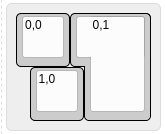
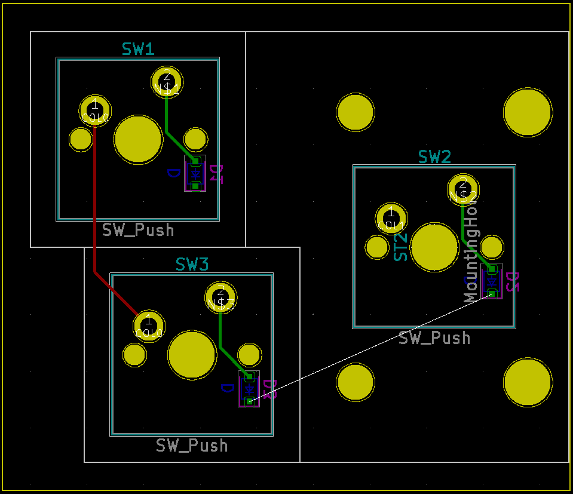

# Examples

## Annotated keys

[keyboard-layout-editor](http://www.keyboard-layout-editor.com) | KiCad PCB (perigoso/keyswitch-kicad-library Cherry MX footprints with routing enabled)
--- | ---
 | 
 | 
 | 
 | 

