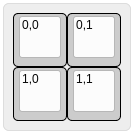

# Features

## Matrix position assignment

By default, KiCad project generator attempts to automatically assign
row and column to a key. This assignment is based on absolute position
of a key.

User can also provide layout with annotated keys. In order to use annotations,
`Matrix->Predefined` must be selected.

Annotations must be defined as **top left** legend and follow this
format: `row,column`, for example:

``` json
["0,0", "0,1"],
["1,0", "1,1"]
```

Which produces this layout:



## Switch footprint

Three footprint types are supported: Cherry MX, Alps and Cherry MX/Alps hybrid.

## Routing

KiCad project generator implements simple track routing. It attempts to connect
switch matrix columns and rows. By default, this option is disabled but user
can turn it on.

::: warning
Router does not implement any checks. It is possible that routed tracks violate
PCB manufacturer design rules or are entirely wrong.

Remember to always run KiCad DRC checks.
:::
