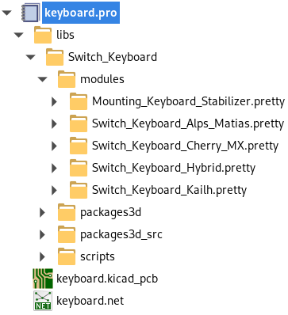

# Guide

KiCad project generator does not generate PCBs ready for fabrication.
User needs to design microcontroller circuit and route everything together.

In this guide I'm using `Default 60%` preset from
[keyboard-layout-editor](www.keyboard-layout-editor.com).

Recommended workflow contains following steps:

- Download json layout of your design (attention: this is not data
  from **Raw data** tab. Use **Download JSON** button).

- Go to [keyboard-tools's](http://keyboard-tools.xyz/) KiCad Project Generator
  tab (1), choose project options (2) and upload keyboard layout (3).

  In this example I decided to use *Cherry MX* footprints  and I enabled
  routing. Because I did not used key annotations (see
  [this](features#matrix-position-assignment)) I used *Automatic* matrix option.

  If everything succeed, after few seconds, PCB preview and
  **Download project** button (4) should appear:

  

- Download and unzip project. Open project located in `keyboard` directory.
  It should contain following structure:

  

  ::: tip
  Generated project has entire selected switch library bundled in.
  This makes footprint replacement easy.
  :::

  `keyboard.kicad_pcb` file should have switches and diodes placed according
  to provided layout like this:

  

  - Run DRC check. In this example, there is one invalid track.

    

    In order to fix it, simple remove faulty track segment and route it manually,
    for example:

    

    Also check if DRC report any unconnected items. For some layouts,
    current router implementation does not attempt to connect items (mainly diodes
    with different `Y` coordinate).

    ::: tip
    Always run DRC check on imported projects. Implemented router does not guarantee
    that rules are met, for details see [this](features#routing).
    :::

- From this point onward, PCB needs to be finished by user.
  - Open `Schematic Layout Editor`, because schematic is not generated there
    will be following prompt:

    

    Select **yes**.

  - Design microcontroller circuit, for example:

    

    For connecting key matix rows/collumns use `Global Labels` with following
    name convention: `ROW{number}`/`COL{number}`

    ::: tip
    Generating MCU circuitry is planned in future releases.
    :::

  - Generate netlist (`Tools->Generate Netlist File`). Remember to rename it,
    otherwise key matrix netlist will be overwritten (by default, KiCad names
    netlist same as project).

  - Open `keyboard.kicad_pcb` and load microcontroller netlist.

    

    Click **Upadate PCB** and **Close**. New components will appear on PCB.

  - Finish placement and routing.
