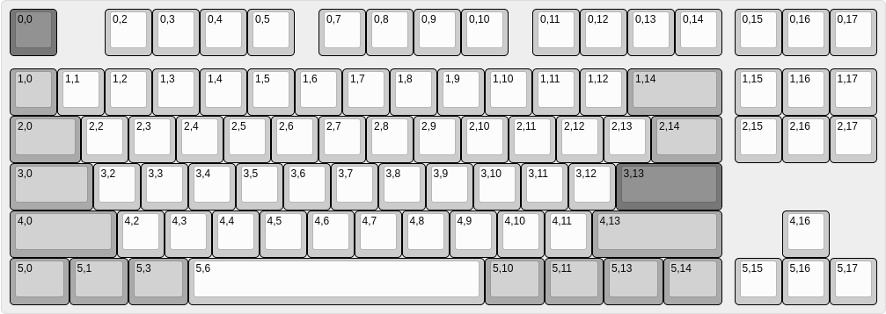
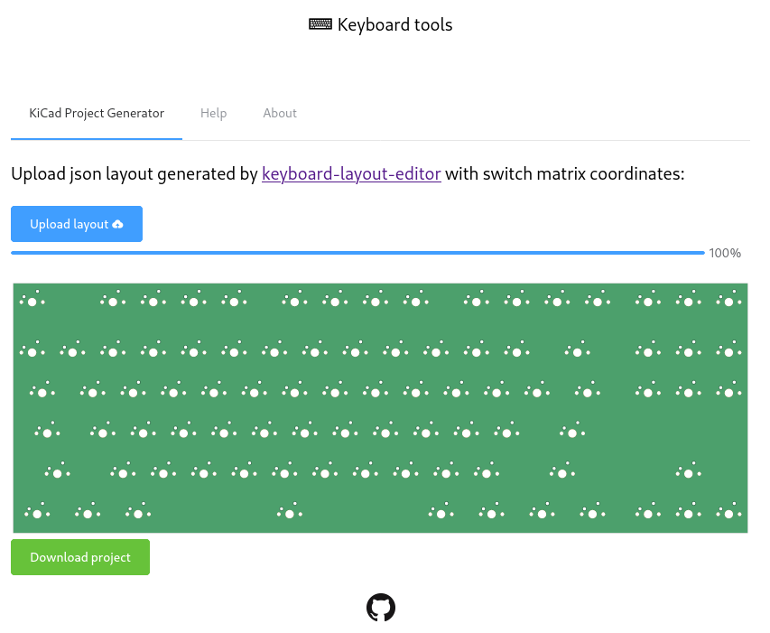
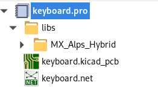
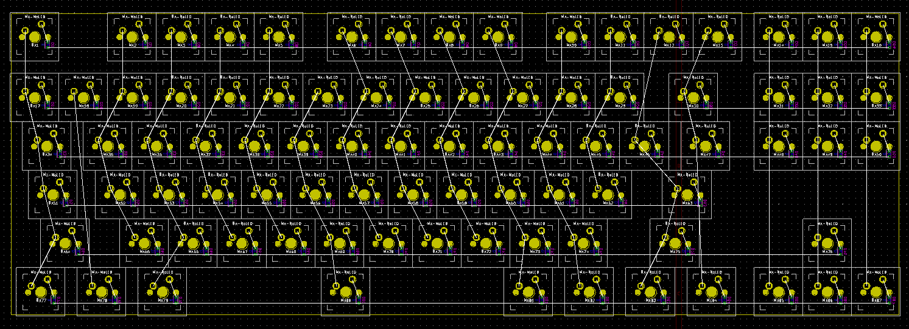
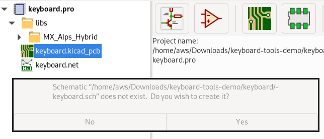
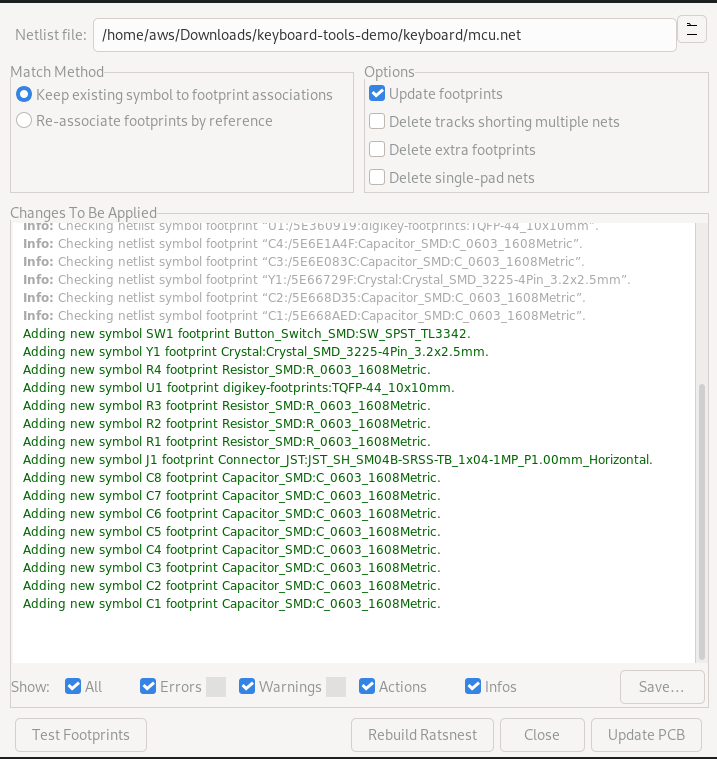
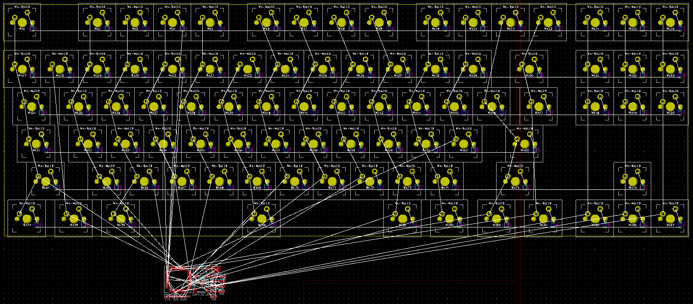

## Workflow guide

KiCad project generator does not generate PCBs ready for fabrication.
User needs to design microcontroller circuit and route everything together.

Recommended workflow contains following steps:

- Prepare layout in [keyboard-layout-editor](www.keyboard-layout-editor.com) with annotated keys.
Each key needs to be have **Top Legend** field set using `row,col` format - this field defines key matrix position.
Example:

- Download json layout of your design (attention: this is not data from **Raw data** tab. Use **Download JSON** button).
Example: [json file](tenkeyless-example.json)

- Run keyboard tools (it is not hosted anywhere yet, currently can be run on local machine only - for details see [this](https://github.com/adamws/keyboard-tools#start-in-development-mode)) and upload downloaded json layout. If everything succeeded, after few seconds **Download project** button should appear:

- Download and unzip project. Open project located in `keyboard` directory. It should contain following structure:

  `keyboard.kicad_pcb` should have switches and diodes placed according to provided layout like this:

- From this point onward, PCB needs to be finished by user.
  - Open `Schematic Layout Editor`, because schematic is not generated there will be following prompt:

    

    Select **yes**.

  - Design microcontroller circuit, for example:

    

    For connecting key matix rows/collumns use `Global Labels` with following name convention: `ROW{number}`/`COLUMN{number}`

  - Generate netlist (`Tools->Generate Netlist File`). Remember to rename it, otherwise key matrix netlist will be overwritten.
  - Open `keyboard.kicad_pcb` and load microcontroller netlist.

    

    Click **Upadate PCB** and **Close**. New components will appear on PCB.

    

  - Finish placement and routing.

